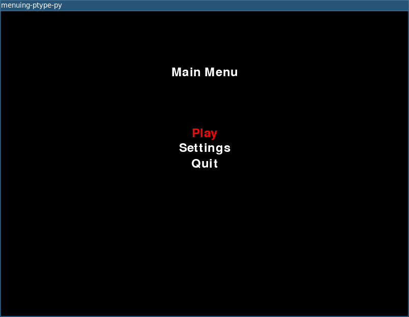

# menuing-ptype-py

Small `pygame` menu prototype from July 2023.

## Archive Note

This repo was a toy project for experimenting with menu flow, settings screens,
audio, simple selection logic, and resolution toggles in Python with `pygame`.
Most of the work on it happened over a short burst from July 16, 2023 through
July 18, 2023. It is not a finished game or framework, just a focused
prototype around menu handling.

The archival cleanup pass happened in March 2026. The project was updated to
run cleanly through `uv`, the asset/audio paths were normalized so it can be
launched from the repo root, and the repo was left in a simple runnable state
rather than pushed toward a larger rewrite.

## Screenshot

## Run

Install the environment:

`uv sync`

Run the prototype:

`uv run menuing-ptype-py`

If you just want the old source layout directly, this also works:

`uv run python src/main.py`
